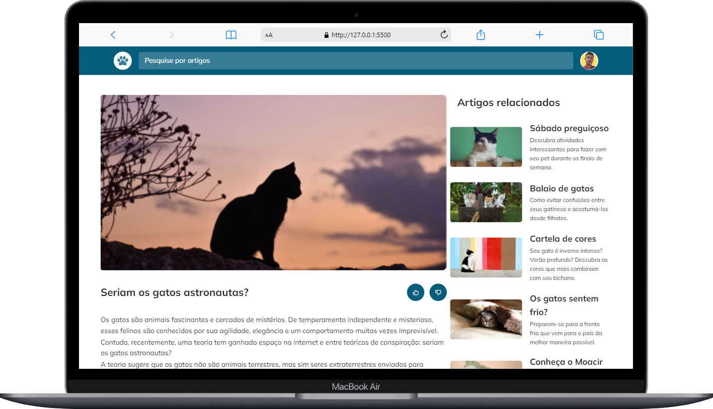
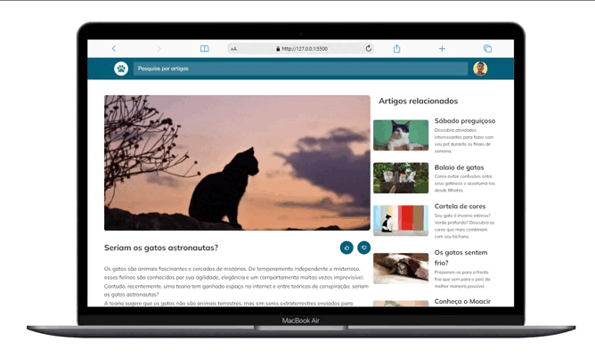
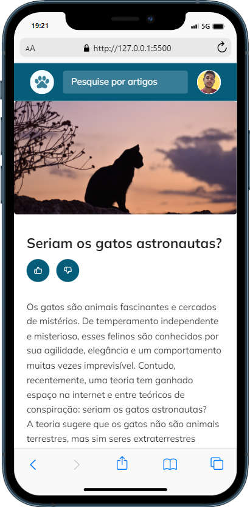

<h1 align="center">Blog de Gatos
</h1>

## 🚀 Tecnologias

Esse projeto foi desenvolvido com as seguintes tecnologias:

- HTML
- CSS

## 💻 Projeto

- Projeto Desenvolvido na Explore da Rocketseat com o proposito de praticar animações, mobile first, grid-template-areas

## sobre

Esse projeto foi feito apartir do aprendizado do curso explorer da rocketseat

## imagens do projeto desktop

## imagens do projeto em display menores

    

